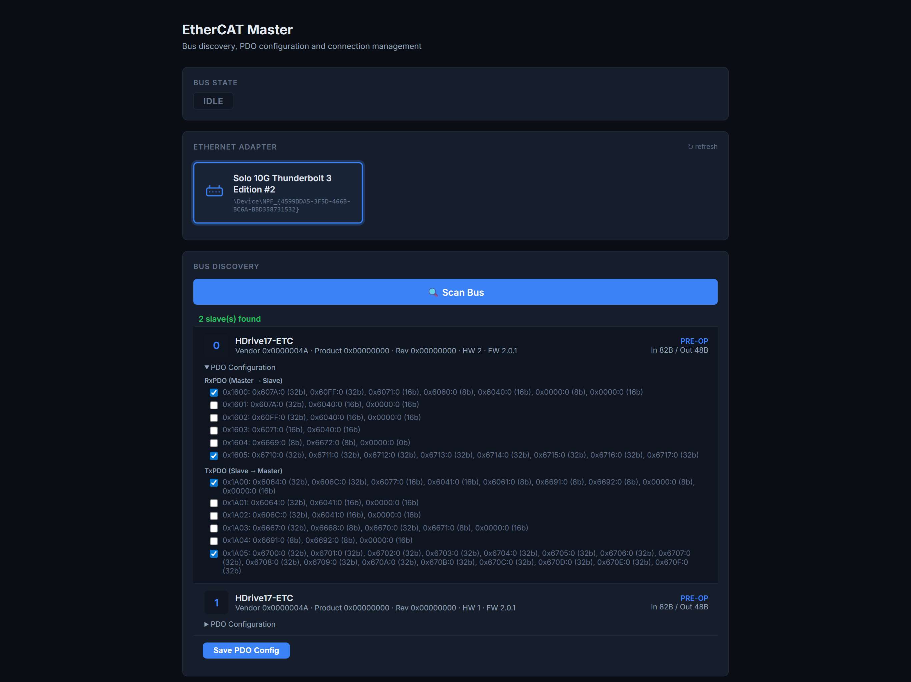
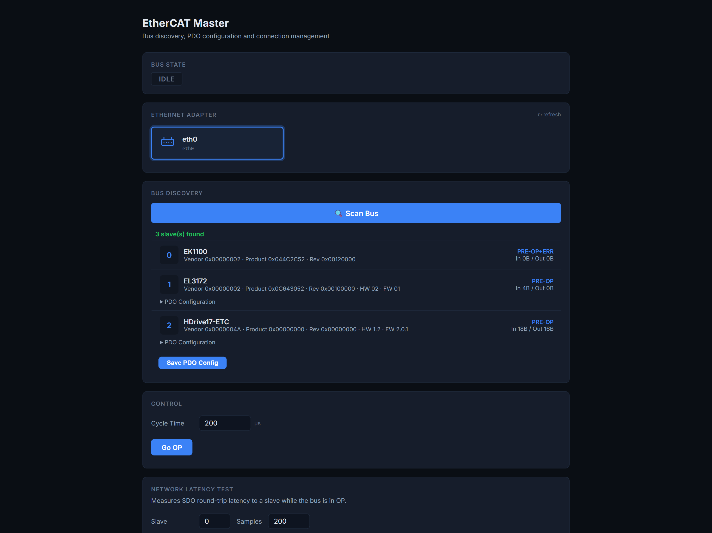
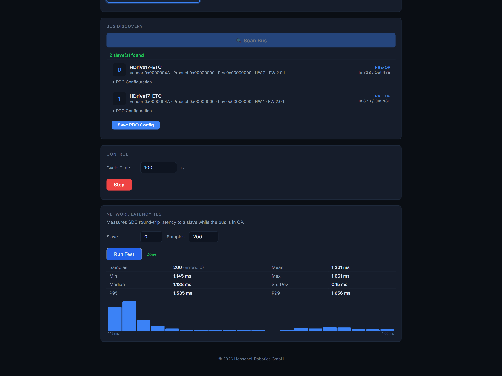

# EtherCAT Master — Web Interface Guide

The built-in web interface lets you manage your EtherCAT bus from any browser. Start it with:

```bash
ecmaster-web
ecmaster-web --port 8080
ecmaster-web --pdo-config /path/to/ethercat_config.json
```

Then open **http://localhost:8080**.

---

## 1. Bus Overview



The main screen combines all bus management in a single view:

### Bus State

The top card shows the current EtherCAT bus state as a colour-coded badge:

| State | Colour | Meaning |
|---|---|---|
| **IDLE** | Grey | Bus not open |
| **PRE-OP** | Amber | Slaves configured, SDO access available |
| **SAFE-OP** | Blue | Transition state (inputs active, outputs zeroed) |
| **OP** | Green | Fully operational — real-time PDO exchange active |

If an error occurs (e.g. failed state transition), a detailed error box appears below the badge showing AL status codes and per-slave diagnostics.

### Adapter Selection

All detected Ethernet adapters are listed as cards. Click one to select it. Wi-Fi, Bluetooth, and loopback adapters are filtered out automatically.

The selected adapter is remembered in `ethercat_config.json` so you don't have to pick it again next time.

### Bus Discovery

Click **Scan Bus** to detect all EtherCAT slaves on the selected adapter. The web GUI discovers **any** EtherCAT device — not just Henschel Robotics products. Third-party devices such as Beckhoff terminals (EK1100 couplers, EL3xxx analog inputs, EL2xxx digital outputs, etc.) are detected and displayed alongside HDrive motors.



For each slave the GUI shows:

- **Device name**, vendor ID, product code, revision
- **Hardware / firmware version** (if available)
- **Current state** (typically PRE-OP after scan)
- **I/O sizes** (input and output byte counts)

### PDO Configuration

Expand the **PDO Configuration** section on any slave to see the available RxPDO and TxPDO assignments. Check/uncheck PDOs and click **Save PDO Config** to persist the selection to `ethercat_config.json`.

After saving, the system automatically disconnects, re-scans the bus, and goes to OP with the new mapping applied.

### Control — Go OP / Stop

- Set the **Cycle Time** (in microseconds) for the real-time PDO exchange.
- Click **Go OP** to open the bus and transition all slaves to Operational state.
- The **Stop** button (red) appears while in OP — click it to close the bus and return to IDLE.

While in OP, the status auto-polls every 3 seconds and updates if the state changes (e.g. after a reconnect or cable event).

---

## 2. Network Latency Test



Available only while in OP. Measures the SDO round-trip latency to a slave:

1. Select the **slave index** and number of **samples** (default 200).
2. Click **Run Test**.
3. Results show min, max, mean, median, P95, P99, and standard deviation.
4. A histogram visualises the latency distribution.

This is useful for verifying cable quality, adapter performance, and system jitter.

---

## CLI Options

```
ecmaster-web [OPTIONS]

  --port PORT           HTTP port (default: 8080)
  --adapter ADAPTER     Network adapter name (e.g. "\Device\NPF_{...}")
  --cycle MICROSECONDS  PDO cycle time in µs (default: 1000)
  --pdo-config PATH     Path to ethercat_config.json
```
